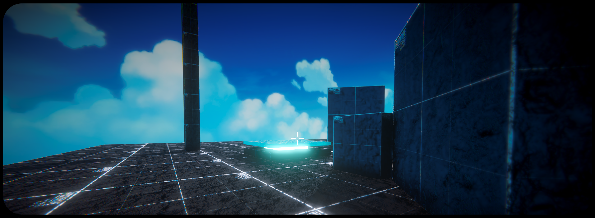
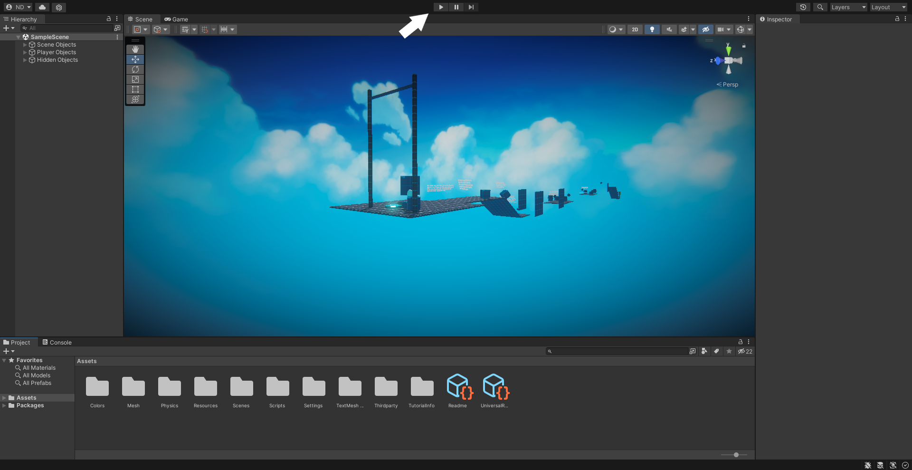

<h1 align="center">
    
</h1>

> **3D Rigibody Movement** is a project I made when I was 12 and learning unity. It was only intended to be shown to my brother, but 2 years later I decided to post it on github as I stopped working with Unity and lost all of the source code of my other projects... 
>
> Note also that this project is an adapted version of the older one I made when I was 12, mainly to make it work with the last Unity LTS release (`2022.3.0f1`) and all of the source code is coming from the original one.

Feel free to take a look at the `Scripts/` folder to take the `PlayerMovement.cs` and put it in your Unity project. 

# The Control & Abilities

Note that you can always adapt the keys to your needs. To modify the main keys (AZERTY to QWERTY) in Unity, go to Edit > Project Settings > Input Manager > Axes and then modify the keys to the ones you choosed by opening the Horizontal and Vertical section.

|Keyboard & Mouse keys      | Action                |
|---------------------------|-----------------------|
| `Z`                       | Move forward          |
| `S`                       | Move backwards        |
| `Q`                       | Go on the left        |
| `D`                       | Go on the right       |
| `Left Shift`              | Run                   |
| `Caps Lock`               | Crouch                |
| `Left Shit` + `Caps Lock` | Slide                 |
| `A`                       | Dash                  |
| `Mouse button 0 (Left)`   | Use the grappling gun |

# Getting Started & Install Unity
* Head out to the [download section of Unity's website](https://unity3d.com/fr/get-unity/download).
* Download [Unity Hub executable](https://public-cdn.cloud.unity3d.com/hub/prod/UnityHubSetup.exe).
* Follow the actions recommended to install unity.
* Once you launched Unity Hub, go to the `Installs` section and install the `2022.3.0f1` version (Note that only need a compiler for your operating system (Mac, Linux or Windows)).
* Now press to the white flag in the top center to launch the project.

